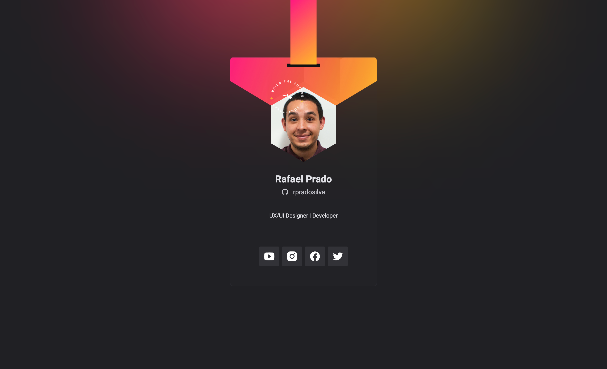

 

    
    <h1>
      Badge DoWhile2021
    </h1>
    Learning web development concepts at Rocketseat's NLW Heat.

 

## About

The project is create a badge to DoWhile2021, a Rocketseat event.

## Features

- [x] Styling CSS with BEM CSS convention
- [x] Fully responsive layout
- [x] Customization data with github API
- [x] Using GSAP to animate some items

## License

This project is protected by the MIT license. See the file [LICENSE](/LICENSE) for more details.

---

### **Developed by** 
